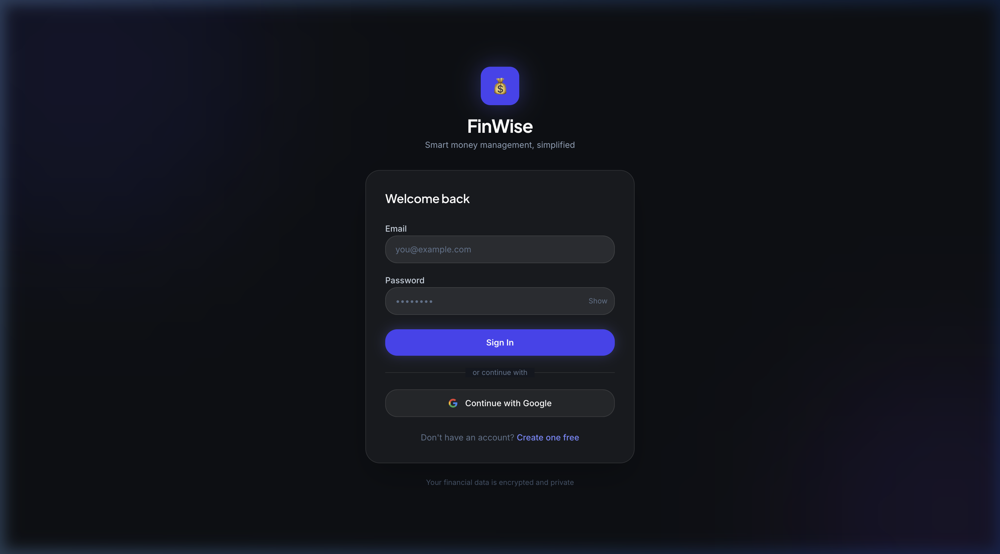
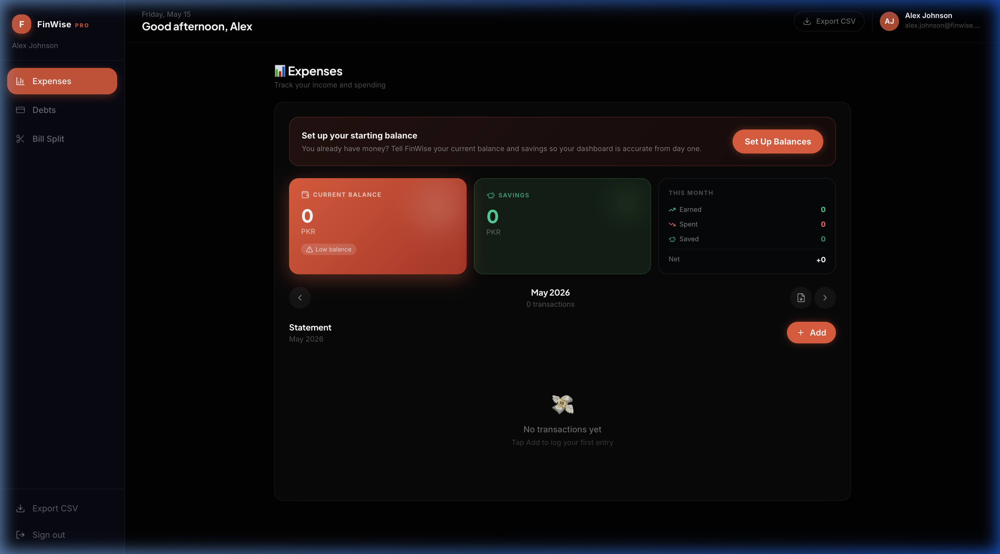
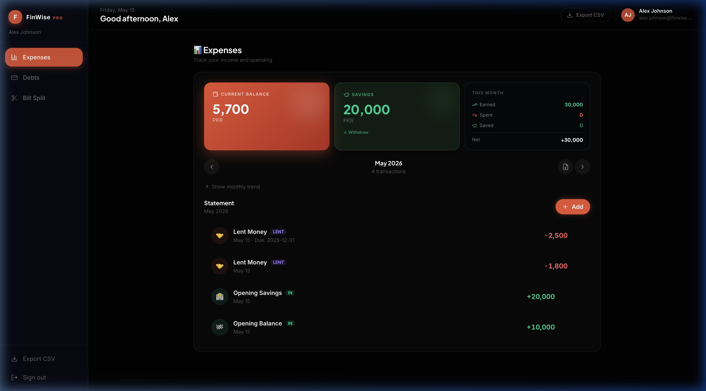
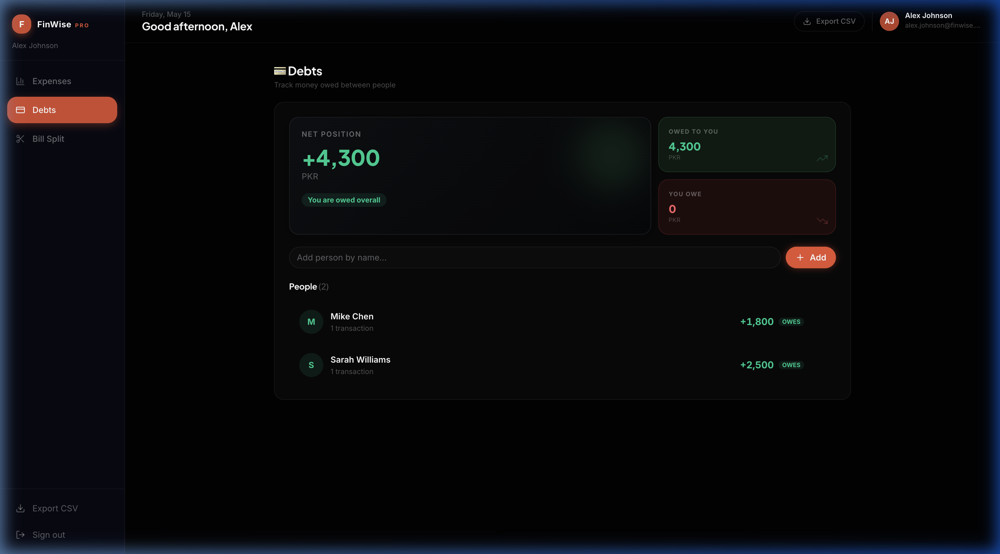
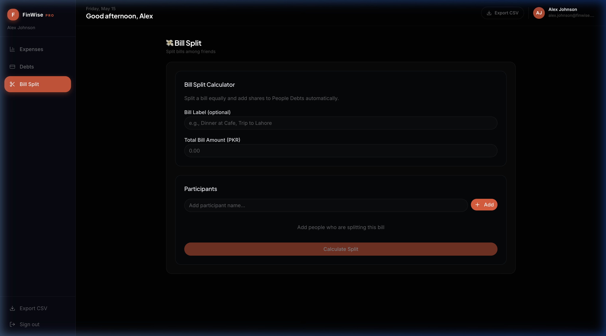

# 💰 FinWise — Smart Money Manager

> **Smart money management, simplified.**

[](http://168.144.35.138:3000/)
[](https://nextjs.org/)
[](https://www.typescriptlang.org/)
[](http://168.144.35.138:3000/)

---

## 🎯 What Is FinWise?

**FinWise** is a modern, full-stack personal finance web application built to simplify how individuals manage their money. It combines **expense tracking**, **debt management**, and **group bill splitting** into one clean, beautifully designed dashboard — with real-time data, encrypted accounts, and a PRO-tier experience.

Whether you're tracking your monthly salary, keeping tabs on who owes you money, or splitting a dinner bill among friends — **FinWise handles it all in one place.**

---

## 🖥️ Screenshots

### Login / Authentication


Clean dark-mode auth screen with Email/Password login, Google OAuth, and a "Create one free" registration link. Encrypted data guarantee shown at the bottom.

---

### Expenses Dashboard — First Login (Empty State)


Personalized greeting, onboarding prompt to "Set up your starting balance", live Current Balance & Savings cards, and a monthly statement area ready to populate.

---

### Expenses Dashboard — Populated with Transactions


- **Current Balance: 5,700 PKR** | **Savings: 20,000 PKR**
- Real transaction feed with color-coded LENT / IN badges
- Monthly statement with ← → navigation to browse history
- Earned / Spent / Saved / Net summary panel

---

### Debts — Track Who Owes You


- **Net Position: +4,300 PKR** — you are owed overall
- Per-person ledger (Mike Chen +1,800 · Sarah Williams +2,500)
- Owed To You vs You Owe split summary
- Add people by name, log transactions per person

---

### Bill Split Calculator


- Enter a bill label, total amount, and participants
- Splits are calculated equally and **auto-synced to Debts** — no manual entry
- Perfect for dinners, trips, shared utilities

---

## 🚀 Core Features

| Feature | Description |
|---|---|
| 🔐 **Secure Auth** | Email/password + Google OAuth — encrypted data |
| 📊 **Expense Tracker** | Log income, spending, savings with monthly statements |
| 💸 **Debt Manager** | Track who owes you / who you owe — net position at a glance |
| 🍽️ **Bill Split** | Split any bill equally and auto-sync to Debts |
| 📅 **Monthly History** | Browse past months with ← → navigation |
| 📤 **CSV Export** | Download full transaction history as a spreadsheet |
| 🌙 **Dark Mode UI** | Premium dark theme with color-coded balance cards |
| 👤 **PRO Tier Ready** | Subscription tier architecture built into the UI |

---

## 🏗️ Tech Stack

| Layer | Technology |
|---|---|
| **Frontend** | Next.js 14 (App Router) |
| **Language** | TypeScript |
| **Styling** | Custom CSS — Dark UI System |
| **Auth** | JWT + Google OAuth |
| **Backend** | Next.js API Routes (REST) |
| **Database** | PostgreSQL (via Prisma / Supabase) |
| **Hosting** | Self-hosted VPS |
| **Export** | Server-side CSV generation |

---

## 🧪 Test Session

A test account was created and fully tested on **May 15, 2026**:

| Transaction | Amount | Type |
|---|---|---|
| Opening Balance | +10,000 PKR | Income |
| Opening Savings | +20,000 PKR | Savings |
| Sarah Williams — Lent | -2,500 PKR | Debt (Due: Dec 31, 2025) |
| Mike Chen — Lent | -1,800 PKR | Debt |

**Result:** Current Balance 5,700 PKR · Savings 20,000 PKR · Net Owed +4,300 PKR · ✅ No bugs found.

---

## 📁 Project Structure

```
finwise/
├── app/
│   ├── api/               # REST API routes
│   │   ├── clients/       # Debt/people management
│   │   └── balance-summary/
│   ├── (auth)/            # Login & Register pages
│   └── dashboard/         # Protected app pages
├── components/            # Reusable UI components
├── lib/                   # Utilities, DB client, auth helpers
├── docs/
│   └── screenshots/       # App screenshots
└── README.md
```

---

## 🎯 Target Market

- **Freelancers** — track client payments and outstanding balances
- **Roommates** — split rent, utilities, groceries fairly
- **Small businesses** — lightweight expense tracking without enterprise overhead
- **Friend groups** — bill splitting for trips, dinners, events
- **Families** — manage household budget in one dashboard

---

## 📈 Monetization Potential

- **SaaS Subscription** — PRO tier already scaffolded in the UI
- **Freemium** — free basic, charge for history / export / multi-account
- **White-label** — resell to accounting firms or fintech startups
- **API Access** — charge for third-party integrations

---

## 💼 What's Included

- ✅ Full Next.js 14 + TypeScript source code
- ✅ Working deployed instance on VPS
- ✅ 3 core modules: Expenses · Debts · Bill Split
- ✅ Authentication system (email + Google OAuth)
- ✅ Full REST API backend with CRUD
- ✅ CSV export functionality
- ✅ PRO subscription tier architecture
- ✅ Mobile-responsive dark theme UI
- ✅ Clean, scalable codebase

---

## 🚀 Getting Started (Local Development)

```bash
# Clone the repo
git clone https://github.com/TheMalikFaheem/finwise.git
cd finwise

# Install dependencies
npm install

# Set up environment variables
cp .env.example .env.local
# Fill in your DB URL, NextAuth secret, Google OAuth credentials

# Run the dev server
npm run dev
```

Open [http://localhost:3000](http://localhost:3000) in your browser.

---

## 🌐 Live Demo

👉 **Try it now:** [http://168.144.35.138:3000/](http://168.144.35.138:3000/)

Create a free account and explore all features in minutes.

---

## 📬 Contact / Acquisition Interest

This is a **production-ready, fully functional** personal finance SaaS application with a clean codebase and a premium UI. If you're a developer or entrepreneur looking for a ready-made fintech product to launch or scale —

**Reach out on LinkedIn or open an issue in this repo.**

---

*Built with ❤️ by [@TheMalikFaheem](https://github.com/TheMalikFaheem)*
